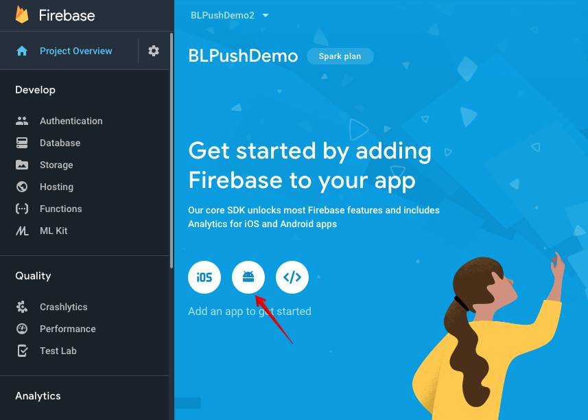
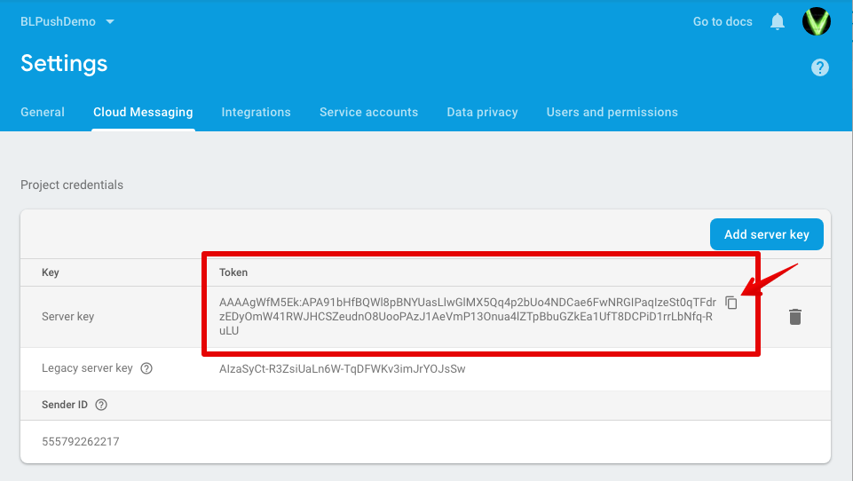
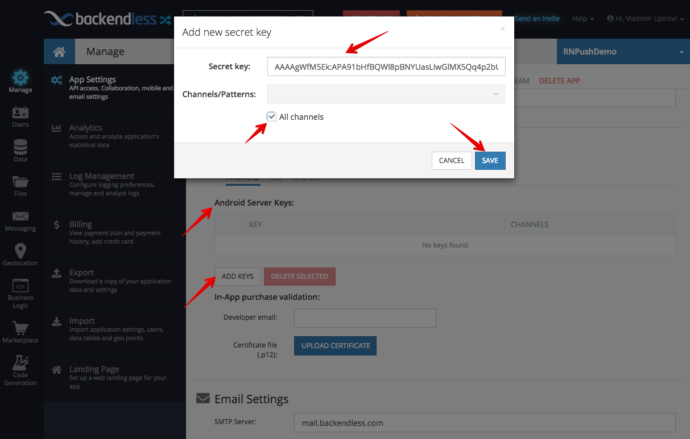

### Setup FCM (Firebase Cloud Messaging)
In order to get Push Notifications working in Android applications, 
you should use Firebase Cloud Messaging (FCM).

- Go to Firebase Console: https://console.firebase.google.com/

- create a new (or choose the existing) Firebase Project.

- Add new Android app:


- Then follow the instructions


- After completion go to Project Settings -> Cloud Messaging, copy “Server key” and paste it into Backendless:
 
 

- add Receiver and Service for getting Push Notifications in /{YOUR_APP_NAME}android/app/src/main/AndroidManifest.xml
````
 <receiver android:name="com.reactlibrary.RNBackendlessPushNotificationActionReceiver"/>

 <service android:name="com.reactlibrary.RNBackendlessPushNotificationService">
    <intent-filter>
        <action android:name="com.google.firebase.MESSAGING_EVENT"/>
    </intent-filter>
</service>
````
