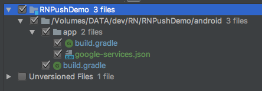

### Setup FCM (Firebase Cloud Messaging)
In order to get Push Notifications working in Android applications, 
you should use Firebase Cloud Messaging (FCM).

- create a new Firebase App.

- configure your Firebase app for Android


- specify your “Android package name”. You can find your package name in manifest file by the next path:  /{YOUR_APP_NAME}/android/app/src/main/AndroidManifest.xml


- download generated “google-services.json” and put it into your project by the next path: /{YOUR_APP_NAME}/android/app/google-services.json

- add two lines as shown on the screenshot:

 **NOTE**: line “implementation ‘com.google.firebase:firebase-core:16.0.1‘” is unnecessary

- At the end, you should have 2 modified files and one new file; make sure you have the same as on the screenshot below:
 

- copy “Server key” from Firebase app and paste the key into Backendless.
 
 

- add Receiver and Service for getting Push Notifications in /{YOUR_APP_NAME}android/app/src/main/AndroidManifest.xml
````
 <receiver android:name="com.reactlibrary.RNBackendlessPushNotificationActionReceiver"/>

 <service android:name="com.reactlibrary.RNBackendlessPushNotificationService">
    <intent-filter>
        <action android:name="com.google.firebase.MESSAGING_EVENT"/>
    </intent-filter>
</service>
````