### Setup project in Xcode

#### Open you project in Xcode 
- run Xcode and open you project 
- or you can do it by the next command in terminal as well 
````bash
open ios/<ProjectName>.xcodeproj
````

#### Basic Setup
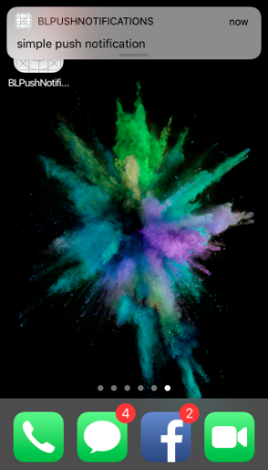

You must specify the `Signing team` for both targets: <ProjectName> and <ProjectName>Test as it shown on the image below
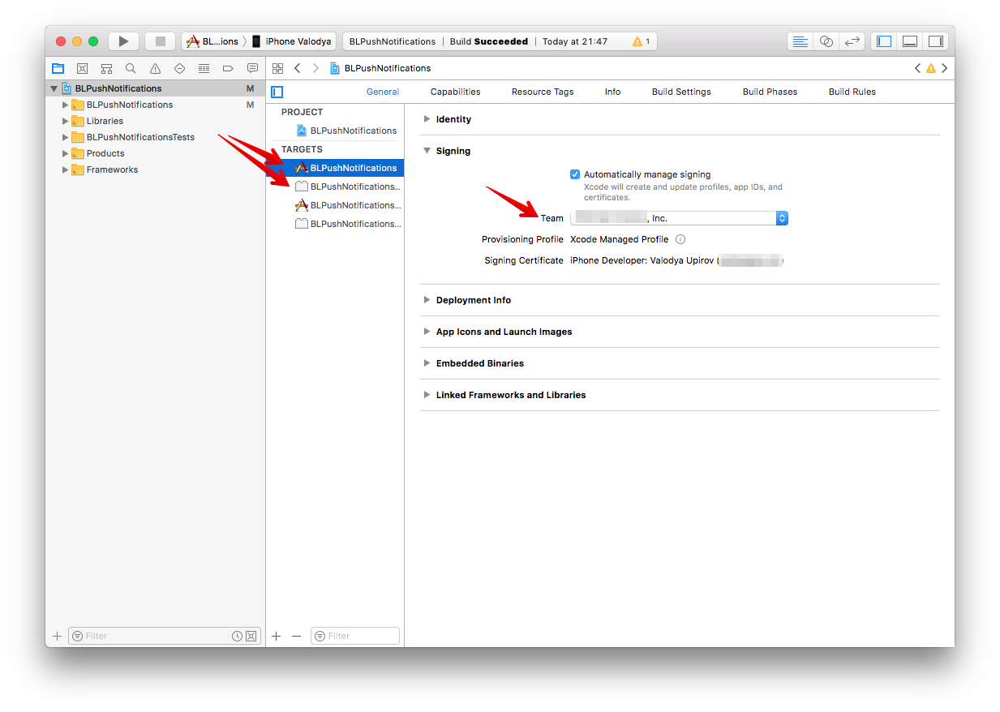

Specify `Bundle identifier` must be the same as in your certificate 
 
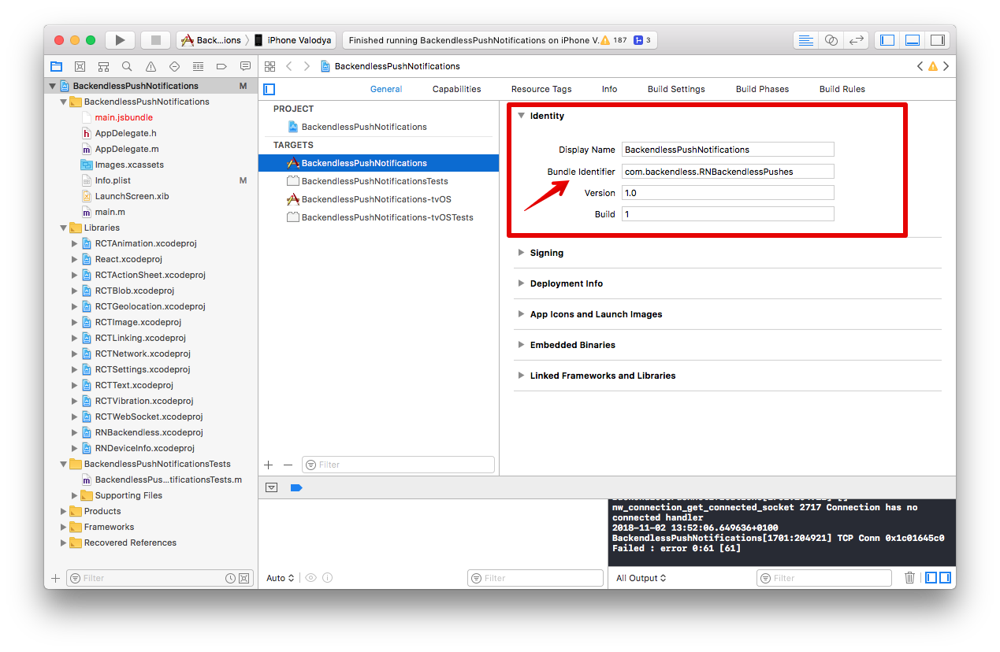

And `RNBackendless` native module into your project’s libraries 
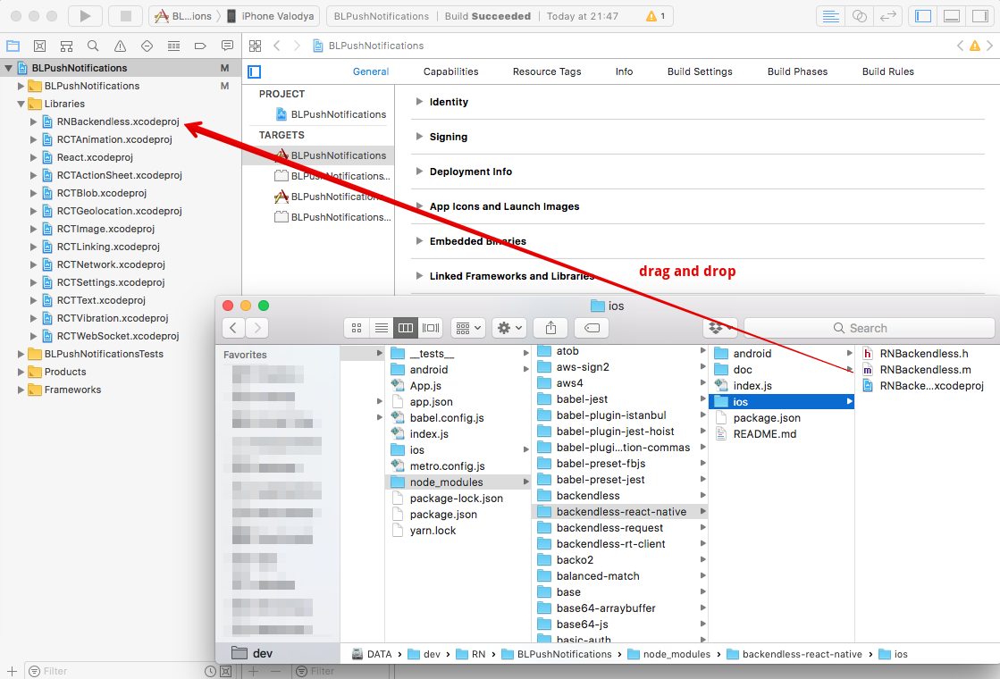

And `RNBackendless` to Build Phases for main target
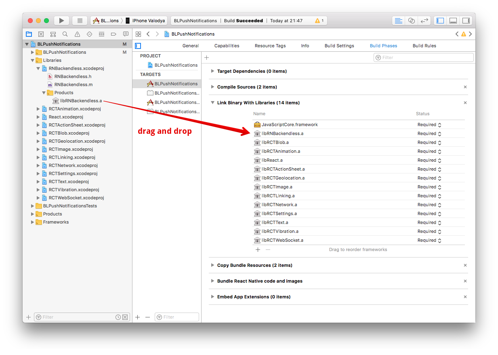

Enable `Push Notifications` compatibility


Modify your AppDelegate.m file

Import RNBackendless library

```` 
#import <RNBackendless/RNBackendless.h>
````

Add the following implementation
```` 
- (void)application:(UIApplication *)application didRegisterUserNotificationSettings:(UIUserNotificationSettings *)notificationSettings
{
  [RNBackendless didRegisterUserNotificationSettings:notificationSettings];
}

- (void)application:(UIApplication *)application didRegisterForRemoteNotificationsWithDeviceToken:(NSData *)deviceToken
{
  [RNBackendless didRegisterForRemoteNotificationsWithDeviceToken:deviceToken];
}

- (void)application:(UIApplication *)application didFailToRegisterForRemoteNotificationsWithError:(NSError *)error
{
  [RNBackendless didFailToRegisterForRemoteNotificationsWithError:error];
}

- (void)userNotificationCenter:(UNUserNotificationCenter *)center didReceiveNotificationResponse:(nonnull UNTextInputNotificationResponse *)response withCompletionHandler:(nonnull void (^)(void))completionHandler
{
  [RNBackendless didReceiveNotificationResponse:response];
  
  completionHandler();
}

- (void)application:(UIApplication *)application didReceiveRemoteNotification:(NSDictionary *)userInfo
{
  [RNBackendless didReceiveRemoteNotification:userInfo];
}

- (void)application:(UIApplication *)application didReceiveRemoteNotification:(NSDictionary *)userInfo
fetchCompletionHandler:(void (^)(UIBackgroundFetchResult))completionHandler
{
  [RNBackendless didReceiveRemoteNotification:userInfo];
  
  completionHandler(UIBackgroundFetchResultNewData);
}
````

And add as the first line of didFinishLaunchingWithOptions implementation the next line:

````
[UNUserNotificationCenter currentNotificationCenter].delegate = self;
````

That’s enough to start receiving simple Remote Push Notification

#### Advanced
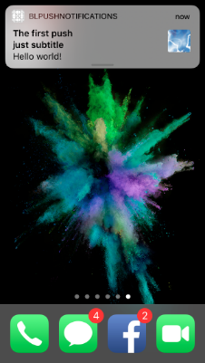 

In order to use `Push Notification Templates` and receive rich notifications, including images and actions you have to add a `Notification Service` and enable `App Groups` and `RNBackendless` will take care about your notifications

### Add Notification Service Extension
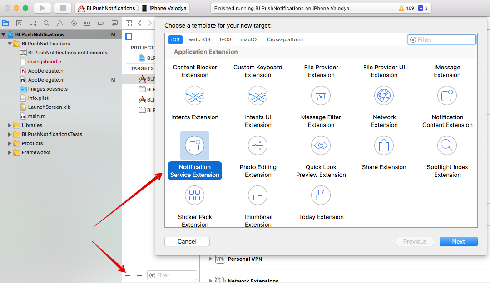
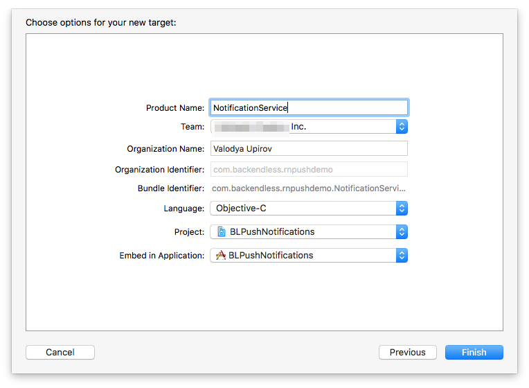

Add to the service React libraries and RNBackendless library
- libRCTWebSocket.a
- libReact.a
- libRNBackendless.a
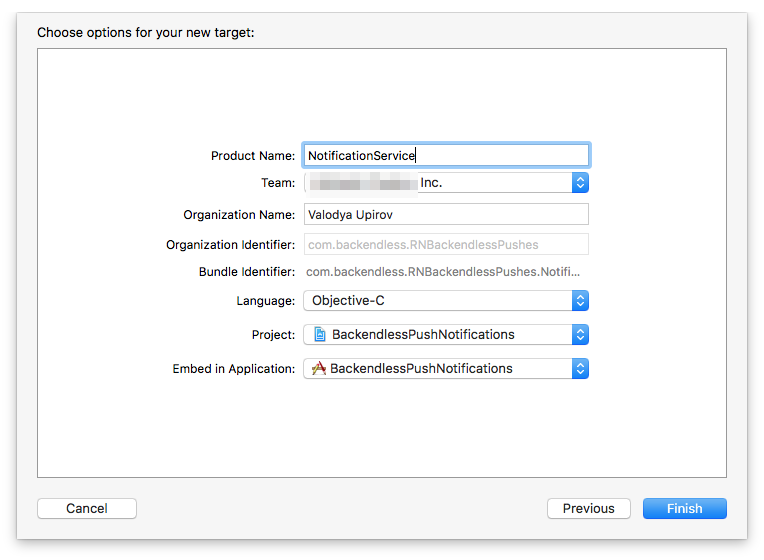

And also you must add `Other Linker Flags` in Build Settings for the NotificationService Extension
````
-ObjC
$(inherited)
-lc++
````
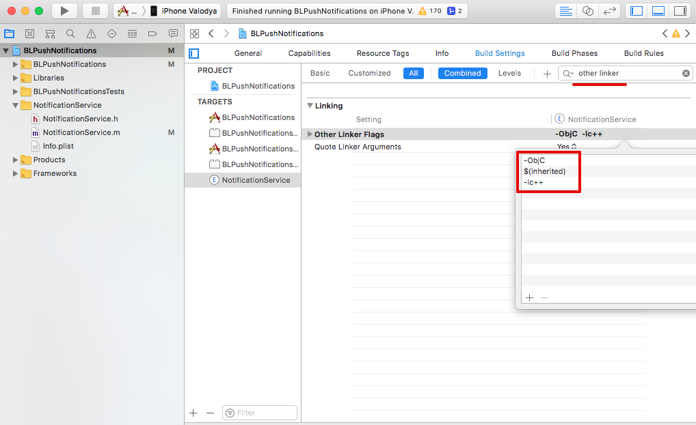

In order to display a push notification based on a `Push Notification Template` need to enable App Group in Capabilities section for the extension, you can read more [here](https://backendless.com/docs/ios/push_xcode_setup_for_apn.html)

The most important thing is your group must contain `BackendlessPushTemplates` phrase   

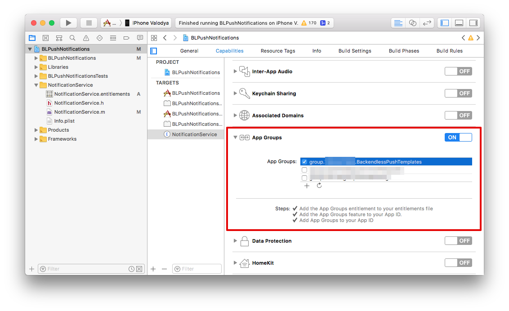
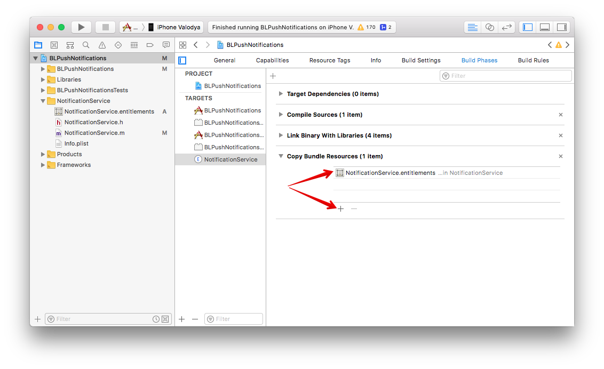

And do the same for main target

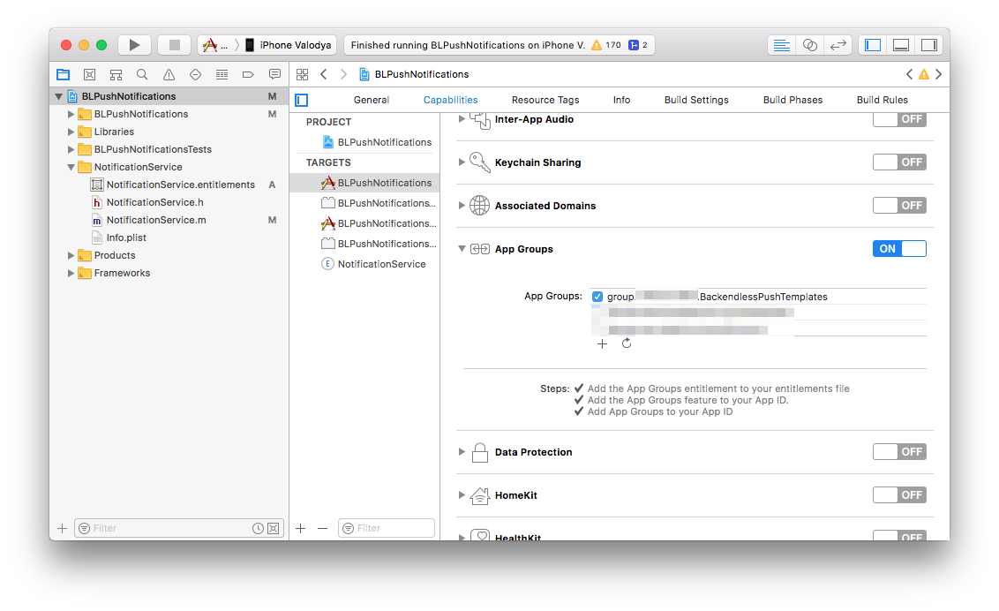
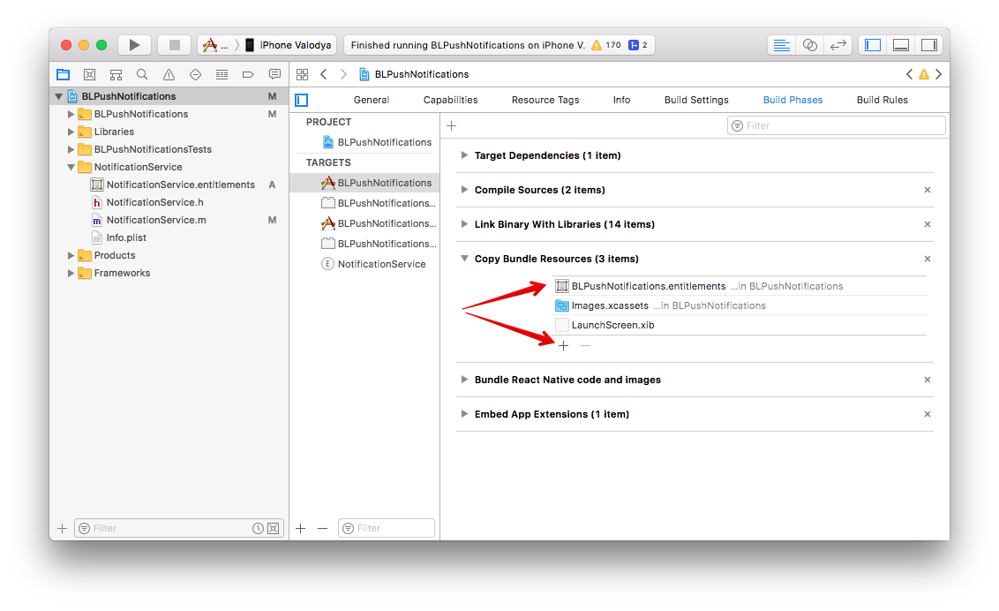

Change `didReceiveNotificationRequest` implementation in `NotificationService.m` file 

````

- (void)didReceiveNotificationRequest:(UNNotificationRequest *)request withContentHandler:(void (^)(UNNotificationContent * _Nonnull))contentHandler {
  self.contentHandler = contentHandler;
  self.bestAttemptContent = [request.content mutableCopy];
  
  [RNBackendless processMutableContent:request withContentHandler:contentHandler];
}

````
