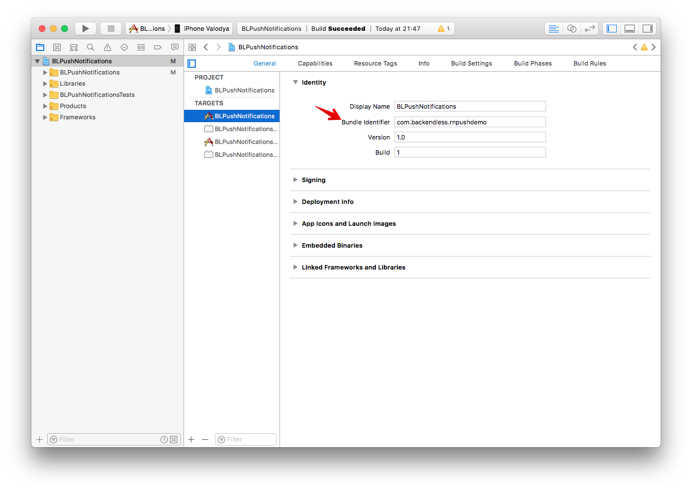
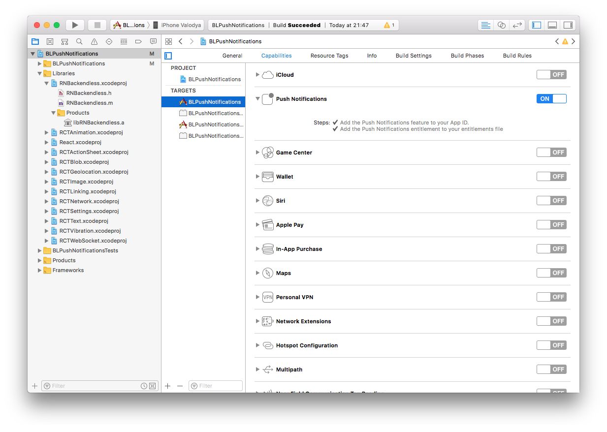
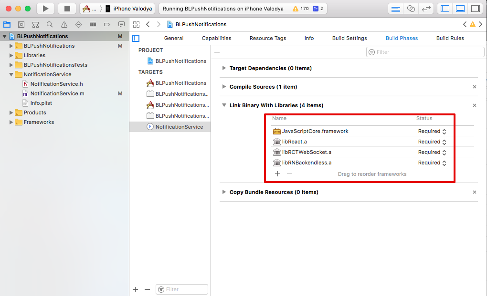

### Setup project in Xcode

#### Open you project in Xcode 
- run Xcode and open you project 
- or you can do it by the next command in terminal as well 
````bash
open ios/<ProjectName>.xcodeproj
````

#### Setup `Signing dev team`
You must define the field for both targets: <ProjectName> and <ProjectName>Test


#### Setup `Bundle identifier`
The value must be the same as in you certificate 



### Add PushNotificationIOS library 
- add the following to your Project: node_modules/react-native/Libraries/PushNotificationIOS/RCTPushNotification.xcodeproj
- add the following to Link Binary With Libraries: libRCTPushNotification.a


### Enable Push Notifications compatibility


### Add Notification Service Extension




Add libraries for the NotificationService Extension
- libRCTWebSocket.a
- libReact.a
- libRNBackendless.a		


And also you must add `Other Linker Flags` in Build Settings for the NotificationService Extension
````
-ObjC
$(inherited)
-lc++
````


### Change AppDelegate files
Add the next line into `AppDelegate.h` file 

````
#import <UserNotifications/UserNotifications.h>
````

Add the next imports into `AppDelegate.m` file
````
#import <React/RCTPushNotificationManager.h>
#import <RNBackendless/RNBackendless.h>
````

Add the next methods into `AppDelegate.m` file
````
// Required to register for notifications
- (void)application:(UIApplication *)application didRegisterUserNotificationSettings:(UIUserNotificationSettings *)notificationSettings
{
  [RCTPushNotificationManager didRegisterUserNotificationSettings:notificationSettings];
}
// Required for the register event.
- (void)application:(UIApplication *)application didRegisterForRemoteNotificationsWithDeviceToken:(NSData *)deviceToken
{
  [RCTPushNotificationManager didRegisterForRemoteNotificationsWithDeviceToken:deviceToken];
}
- (void)userNotificationCenter:(UNUserNotificationCenter *)center didReceiveNotificationResponse:(nonnull UNNotificationResponse *)response withCompletionHandler:(nonnull void (^)(void))completionHandler
{
  [RNBackendless didReceiveNotificationResponse:response];

  completionHandler();
}
// Required for the notification event. You must call the completion handler after handling the remote notification.
- (void)application:(UIApplication *)application didReceiveRemoteNotification:(NSDictionary *)userInfo
fetchCompletionHandler:(void (^)(UIBackgroundFetchResult))completionHandler
{
  [RCTPushNotificationManager didReceiveRemoteNotification:userInfo fetchCompletionHandler:completionHandler];
}
// Required for the registrationError event.
- (void)application:(UIApplication *)application didFailToRegisterForRemoteNotificationsWithError:(NSError *)error
{
  [RCTPushNotificationManager didFailToRegisterForRemoteNotificationsWithError:error];
}
// Required for the localNotification event.
- (void)application:(UIApplication *)application didReceiveLocalNotification:(UILocalNotification *)notification
{
  [RCTPushNotificationManager didReceiveLocalNotification:notification];
}
````

Add the next line into `didFinishLaunchingWithOptions` method, as the first line in the method  
````
 [UNUserNotificationCenter currentNotificationCenter].delegate = self;
````

### Change Notification Service Extension files

Replace content in `NotificationService.m` file with the next code
````
//
//  NotificationService.m
//  NotificationService
//
//  Copyright © 2018 Facebook. All rights reserved.
//

#import "NotificationService.h"
#import <RNBackendless/RNBackendless.h>

@interface NotificationService ()

@property (nonatomic, strong) void (^contentHandler)(UNNotificationContent *contentToDeliver);
@property (nonatomic, strong) UNMutableNotificationContent *bestAttemptContent;

@end

@implementation NotificationService

- (void)didReceiveNotificationRequest:(UNNotificationRequest *)request withContentHandler:(void (^)(UNNotificationContent * _Nonnull))contentHandler {
  self.contentHandler = contentHandler;
  self.bestAttemptContent = [request.content mutableCopy];
  
  [RNBackendless processMutableContent:request withContentHandler:contentHandler];
}

- (void)serviceExtensionTimeWillExpire {
  // Called just before the extension will be terminated by the system.
  // Use this as an opportunity to deliver your "best attempt" at modified content, otherwise the original push payload will be used.
  self.contentHandler(self.bestAttemptContent);
}

@end


````
